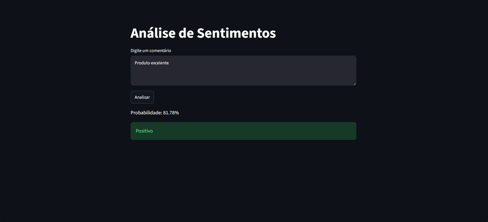

# Análise de Sentimentos com TensorFlow, Keras e Streamlit

Projeto de Processamento de Linguagem Natural (NLP) desenvolvido em Python utilizando TensorFlow e Keras para classificar comentários como **positivos** ou **negativos**.

O projeto também conta com uma interface web construída com Streamlit para testar previsões em tempo real.



## Objetivo

Treinar uma rede neural capaz de identificar o sentimento de uma frase a partir de exemplos previamente rotulados.

Exemplos:

| Texto                   | Sentimento |
| ----------------------- | ---------- |
| Gostei muito do produto | Positivo   |
| Atendimento excelente   | Positivo   |
| Produto ruim            | Negativo   |
| Não recomendo           | Negativo   |

---

## Tecnologias Utilizadas

* Python
* Pandas
* NumPy
* Scikit-Learn
* TensorFlow
* Keras
* Streamlit
* Jupyter Notebook

---

## Estrutura do Projeto

```text
ANALISE-DE-SENTIMENTOS
│
├── data
│   └── sentimentos.csv
│
├── models
│   └── modelo_sentimentos.keras
│
├── notebooks
│   └── analise.ipynb
│
├── src
│   ├── train.py
│   └── predict.py
│
├── app.py
├── requirements.txt
├── .gitignore
└── README.md
```

---

## Como Executar

### 1. Clonar o repositório

```bash
git clone <URL_DO_REPOSITORIO>
cd ANALISE-DE-SENTIMENTOS
```

### 2. Criar ambiente virtual

```bash
python -m venv venv
```

### Windows

```bash
venv\Scripts\activate
```

### Linux/macOS

```bash
source venv/bin/activate
```

### 3. Instalar dependências

```bash
pip install -r requirements.txt
```

---

## Treinar o Modelo

```bash
python src/train.py
```

O treinamento irá:

* Ler o dataset
* Dividir os dados em treino e teste
* Vetorizar os textos
* Treinar a rede neural
* Avaliar a acurácia
* Salvar o modelo em:

```text
models/modelo_sentimentos.keras
```

---

## Fazer Previsões pelo Terminal

```bash
python src/predict.py
```

Exemplo de saída:

```text
Probabilidade: 87.31%
Positivo
```

---

## Interface Web com Streamlit

Para iniciar a aplicação web:

```bash
streamlit run app.py
```

A interface permite digitar comentários e receber instantaneamente a previsão do modelo, exibindo:

* Probabilidade calculada
* Classificação positiva ou negativa
* Resultado em tempo real

---

## Arquitetura da Rede Neural

O modelo utiliza:

* TextVectorization
* Embedding
* GlobalAveragePooling1D
* Dense (ReLU)
* Dense (Sigmoid)

Fluxo:

```text
Texto
 ↓
TextVectorization
 ↓
Embedding
 ↓
GlobalAveragePooling1D
 ↓
Dense (ReLU)
 ↓
Dense (Sigmoid)
 ↓
Probabilidade de sentimento positivo
```

---

## Conceitos Aplicados

* Processamento de Linguagem Natural (NLP)
* Vetorização de Texto
* Embeddings
* Redes Neurais
* Classificação Binária
* Binary Crossentropy
* Treinamento e Inferência
* Persistência de Modelos (.keras)
* Deploy de aplicações com Streamlit

---

## Possíveis Melhorias Futuras

* Dataset maior e mais diversificado
* Classificação em múltiplas categorias
* Uso de modelos mais avançados (LSTM, GRU ou Transformers)
* Integração com APIs
